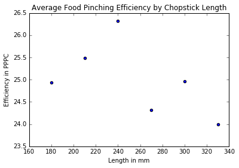

#Project 0-testing demo: The relationship between Chopsticks length and its food-pinching performance

### Background: An investigation for determining the optimum length of chopsticks.
[Link to Abstract and Paper](http://www.ncbi.nlm.nih.gov/pubmed/15676839)  

A few researchers set out to determine the optimal length of chopsticks for children and adults. They came up with a measure of how effective a pair of chopsticks performed, called the "Food Pinching Performance." The "Food Pinching Performance" was determined by counting the number of peanuts picked and placed in a cup (PPPC).

*the abstract below was adapted from the link*

Chopsticks are one of the most simple and popular hand tools ever invented by humans, but have not previously been investigated by [ergonomists](https://www.google.com/search?q=ergonomists). Two laboratory studies were conducted in this research, using a [randomised complete block design](http://dawg.utk.edu/glossary/whatis_rcbd.htm), to evaluate the effects of the length of the chopsticks on the food-serving performance of adults and children. Thirty-one male junior college students and 21 primary school pupils served as subjects for the experiment to test chopsticks lengths of 180, 210, 240, 270, 300, and 330 mm. The results showed that the food-pinching performance was significantly affected by the length of the chopsticks, and that chopsticks of about 240 and 180 mm long were optimal for adults and pupils, respectively. Based on these findings, the researchers suggested that families with children should provide both 240 and 180 mm long chopsticks. In addition, restaurants could provide 210 mm long chopsticks, considering the trade-offs between ergonomics and cost.

#### Analysis: 

#### 1. What is the independent variable in the experiment?
 the performance/efficiency of pinching food


#### 2. What is the dependent variable in the experiment?
Dependent variable is determined by counting the number of peanuts picked and placed in a cup


#### 3. How is the dependent variable operationally defined?

Dependent variable is determined by counting the number of peanuts picked and placed in a cup


#### 4. Based on the description of the experiment and the data set, list at least two variables that you know were controlled.
1. food used in determining food-pinching-performance is controlled 
2. time used in counting the number of peanuts picked and placed in a cup is controlled


```python
import pandas as pd

# pandas is a software library for data manipulation and analysis
# We commonly use shorter nicknames for certain packages. Pandas is often abbreviated to pd.
# hit shift + enter to run this cell or block of code
```


```python
path = r'~/GitHub/data-analysis-nanodgree_projects/p0-chopstick-length-analysis/chopstick-effectiveness.csv'

dataFrame = pd.read_csv(path)
dataFrame
```


<div>
<table border="1" class="dataframe">
  <thead>
    <tr style="text-align: right;">
      <th></th>
      <th>Food.Pinching.Efficiency</th>
      <th>Individual</th>
      <th>Chopstick.Length</th>
    </tr>
  </thead>
  <tbody>
    <tr>
      <th>0</th>
      <td>19.55</td>
      <td>1</td>
      <td>180</td>
    </tr>
    <tr>
      <th>1</th>
      <td>27.24</td>
      <td>2</td>
      <td>180</td>
    </tr>
    <tr>
      <th>2</th>
      <td>28.76</td>
      <td>3</td>
      <td>180</td>
    </tr>
    <tr>
      <th>3</th>
      <td>31.19</td>
      <td>4</td>
      <td>180</td>
    </tr>
    <tr>
      <th>4</th>
      <td>21.91</td>
      <td>5</td>
      <td>180</td>
    </tr>
    <tr>
      <th>5</th>
      <td>27.62</td>
      <td>6</td>
      <td>180</td>
    </tr>
    <tr>
      <th>6</th>
      <td>29.46</td>
      <td>7</td>
      <td>180</td>
    </tr>
    <tr>
      <th>7</th>
      <td>26.35</td>
      <td>8</td>
      <td>180</td>
    </tr>
    <tr>
      <th>8</th>
      <td>26.69</td>
      <td>9</td>
      <td>180</td>
    </tr>
    <tr>
      <th>9</th>
      <td>30.22</td>
      <td>10</td>
      <td>180</td>
    </tr>
    <tr>
      <th>10</th>
      <td>27.81</td>
      <td>11</td>
      <td>180</td>
    </tr>
    <tr>
      <th>11</th>
      <td>23.46</td>
      <td>12</td>
      <td>180</td>
    </tr>
    <tr>
      <th>12</th>
      <td>23.64</td>
      <td>13</td>
      <td>180</td>
    </tr>
    <tr>
      <th>13</th>
      <td>27.85</td>
      <td>14</td>
      <td>180</td>
    </tr>
    <tr>
      <th>14</th>
      <td>20.62</td>
      <td>15</td>
      <td>180</td>
    </tr>
    <tr>
      <th>15</th>
      <td>25.35</td>
      <td>16</td>
      <td>180</td>
    </tr>
    <tr>
      <th>16</th>
      <td>28.00</td>
      <td>17</td>
      <td>180</td>
    </tr>
    <tr>
      <th>17</th>
      <td>23.49</td>
      <td>18</td>
      <td>180</td>
    </tr>
    <tr>
      <th>18</th>
      <td>27.77</td>
      <td>19</td>
      <td>180</td>
    </tr>
    <tr>
      <th>19</th>
      <td>18.48</td>
      <td>20</td>
      <td>180</td>
    </tr>
    <tr>
      <th>20</th>
      <td>23.01</td>
      <td>21</td>
      <td>180</td>
    </tr>
    <tr>
      <th>21</th>
      <td>22.66</td>
      <td>22</td>
      <td>180</td>
    </tr>
    <tr>
      <th>22</th>
      <td>23.24</td>
      <td>23</td>
      <td>180</td>
    </tr>
    <tr>
      <th>23</th>
      <td>22.82</td>
      <td>24</td>
      <td>180</td>
    </tr>
    <tr>
      <th>24</th>
      <td>17.94</td>
      <td>25</td>
      <td>180</td>
    </tr>
    <tr>
      <th>25</th>
      <td>26.67</td>
      <td>26</td>
      <td>180</td>
    </tr>
    <tr>
      <th>26</th>
      <td>28.98</td>
      <td>27</td>
      <td>180</td>
    </tr>
    <tr>
      <th>27</th>
      <td>21.48</td>
      <td>28</td>
      <td>180</td>
    </tr>
    <tr>
      <th>28</th>
      <td>14.47</td>
      <td>29</td>
      <td>180</td>
    </tr>
    <tr>
      <th>29</th>
      <td>28.29</td>
      <td>30</td>
      <td>180</td>
    </tr>
    <tr>
      <th>...</th>
      <td>...</td>
      <td>...</td>
      <td>...</td>
    </tr>
    <tr>
      <th>156</th>
      <td>26.18</td>
      <td>2</td>
      <td>330</td>
    </tr>
    <tr>
      <th>157</th>
      <td>25.93</td>
      <td>3</td>
      <td>330</td>
    </tr>
    <tr>
      <th>158</th>
      <td>28.61</td>
      <td>4</td>
      <td>330</td>
    </tr>
    <tr>
      <th>159</th>
      <td>20.54</td>
      <td>5</td>
      <td>330</td>
    </tr>
    <tr>
      <th>160</th>
      <td>26.44</td>
      <td>6</td>
      <td>330</td>
    </tr>
    <tr>
      <th>161</th>
      <td>29.36</td>
      <td>7</td>
      <td>330</td>
    </tr>
    <tr>
      <th>162</th>
      <td>19.77</td>
      <td>8</td>
      <td>330</td>
    </tr>
    <tr>
      <th>163</th>
      <td>31.69</td>
      <td>9</td>
      <td>330</td>
    </tr>
    <tr>
      <th>164</th>
      <td>24.64</td>
      <td>10</td>
      <td>330</td>
    </tr>
    <tr>
      <th>165</th>
      <td>22.09</td>
      <td>11</td>
      <td>330</td>
    </tr>
    <tr>
      <th>166</th>
      <td>23.42</td>
      <td>12</td>
      <td>330</td>
    </tr>
    <tr>
      <th>167</th>
      <td>28.63</td>
      <td>13</td>
      <td>330</td>
    </tr>
    <tr>
      <th>168</th>
      <td>26.30</td>
      <td>14</td>
      <td>330</td>
    </tr>
    <tr>
      <th>169</th>
      <td>22.89</td>
      <td>15</td>
      <td>330</td>
    </tr>
    <tr>
      <th>170</th>
      <td>22.68</td>
      <td>16</td>
      <td>330</td>
    </tr>
    <tr>
      <th>171</th>
      <td>30.92</td>
      <td>17</td>
      <td>330</td>
    </tr>
    <tr>
      <th>172</th>
      <td>20.74</td>
      <td>18</td>
      <td>330</td>
    </tr>
    <tr>
      <th>173</th>
      <td>27.24</td>
      <td>19</td>
      <td>330</td>
    </tr>
    <tr>
      <th>174</th>
      <td>17.12</td>
      <td>20</td>
      <td>330</td>
    </tr>
    <tr>
      <th>175</th>
      <td>23.63</td>
      <td>21</td>
      <td>330</td>
    </tr>
    <tr>
      <th>176</th>
      <td>20.91</td>
      <td>22</td>
      <td>330</td>
    </tr>
    <tr>
      <th>177</th>
      <td>23.49</td>
      <td>23</td>
      <td>330</td>
    </tr>
    <tr>
      <th>178</th>
      <td>24.86</td>
      <td>24</td>
      <td>330</td>
    </tr>
    <tr>
      <th>179</th>
      <td>16.28</td>
      <td>25</td>
      <td>330</td>
    </tr>
    <tr>
      <th>180</th>
      <td>21.52</td>
      <td>26</td>
      <td>330</td>
    </tr>
    <tr>
      <th>181</th>
      <td>27.22</td>
      <td>27</td>
      <td>330</td>
    </tr>
    <tr>
      <th>182</th>
      <td>17.41</td>
      <td>28</td>
      <td>330</td>
    </tr>
    <tr>
      <th>183</th>
      <td>16.42</td>
      <td>29</td>
      <td>330</td>
    </tr>
    <tr>
      <th>184</th>
      <td>28.22</td>
      <td>30</td>
      <td>330</td>
    </tr>
    <tr>
      <th>185</th>
      <td>27.52</td>
      <td>31</td>
      <td>330</td>
    </tr>
  </tbody>
</table>
<p>186 rows × 3 columns</p>
</div>


### the mean value for the number of peanuts picked and placed in the cup: 

An investigation for determining the optimum length of chopsticks.


```python
dataFrame['Food.Pinching.Efficiency'].mean()
```


    25.00559139784947


```python
meansByChopstickLength = dataFrame.groupby('Chopstick.Length')['Food.Pinching.Efficiency'].mean().reset_index()
meansByChopstickLength

# reset_index() changes Chopstick.Length from an index to column. Instead of the index being the length of the chopsticks, the index is the row numbers 0, 1, 2, 3, 4, 5.
```


<div>
<table border="1" class="dataframe">
  <thead>
    <tr style="text-align: right;">
      <th></th>
      <th>Chopstick.Length</th>
      <th>Food.Pinching.Efficiency</th>
    </tr>
  </thead>
  <tbody>
    <tr>
      <th>0</th>
      <td>180</td>
      <td>24.935161</td>
    </tr>
    <tr>
      <th>1</th>
      <td>210</td>
      <td>25.483871</td>
    </tr>
    <tr>
      <th>2</th>
      <td>240</td>
      <td>26.322903</td>
    </tr>
    <tr>
      <th>3</th>
      <td>270</td>
      <td>24.323871</td>
    </tr>
    <tr>
      <th>4</th>
      <td>300</td>
      <td>24.968065</td>
    </tr>
    <tr>
      <th>5</th>
      <td>330</td>
      <td>23.999677</td>
    </tr>
  </tbody>
</table>
</div>


#### 5. Which chopstick length performed the best for the group of thirty-one male junior college students?

240mm


```python
# Causes plots to display within the notebook rather than in a new window
%pylab inline

import matplotlib.pyplot as plt

plt.scatter(x=meansByChopstickLength['Chopstick.Length'], y=meansByChopstickLength['Food.Pinching.Efficiency'])
            # title="")
plt.xlabel("Length in mm")
plt.ylabel("Efficiency in PPPC")
plt.title("Average Food Pinching Efficiency by Chopstick Length")
plt.show()
```

    Populating the interactive namespace from numpy and matplotlib





#### 6. Based on the scatterplot created from the code above, interpret the relationship you see. What do you notice?

First of all, 240mm is the optimal length for chopsticks regarding the food-pinching performance. For chopsticks shorter than 240mm, the shorter the chopsticks, the smaller the value of average food-pinching efficiency. For chopsticks longer than 240mm, the longer the chopsticks, the smaller the value of average food-pinching efficiency.

### In the abstract the researchers stated that their results showed food-pinching performance was significantly affected by the length of the chopsticks, and that chopsticks of about 240 mm long were optimal for adults.

#### 7a. Based on the data you have analyzed, do you agree with the claim?
Yes. 

#### 7b. Why?

Because the scatterplot suggests that the performance of chopsticks will decrease for any lengths smaller or longer than 240mm. 


```python

```
