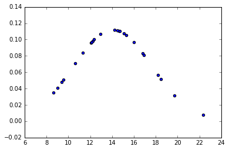
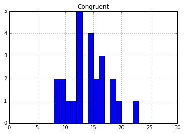
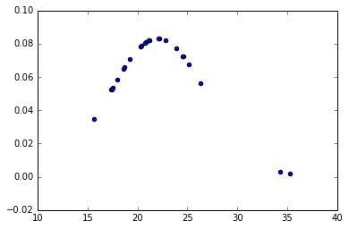
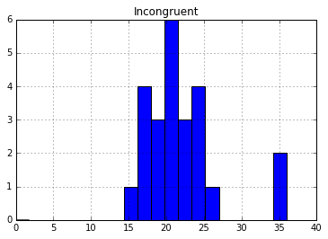

# Test a Perceptual Phenomenon

## Background information

In a Stroop task, participants are presented with a list of words, with each word displayed in a color of ink. The participant’s task is to say out loud the color of the ink in which the word is printed. The task has two conditions: a congruent words condition, and an incongruent words condition. In the congruent words condition, the words being displayed are color words whose names match the colors in which they are printed. In the incongruent words condition, the words displayed are color words whose names do not match the colors in which they are printed. In each case, we measure the time it takes to name the ink colors in equally-sized lists. Each participant will go through and record a time from each condition.

[Link to Data Set](https://github.com/ronafan/data-analysis-nanodgree_projects/blob/master/p1-perceptual-phenomenon/stroopdata.csv)  


# Question for Investigation 

1.What is our independent variable? What is our dependent variable?

**Independent Variable**: The time spent on reading out the color of the word.

**Dependent Variable**: The condition of word (congruent/incongruent)

2.What is an appropriate set of hypotheses for this task? What kind of statistical test do you expect to perform? Justify your choices.

**H<sub>0</sub>: η<sub>1</sub> = η<sub>2</sub>:** The median time spent on naming color of text of the first population(congruent) equals the median of the second population (incongruent).

**H<sub>1</sub>: η<sub>1</sub> ≠ η<sub>2</sub>:** The median time spent on naming color of text of the first population(congruent) *does not* equal the median of the second population (incongruent).

**statistical test:**

 [Normal probability plot (Congruent)](https://github.com/ronafan/data-analysis-nanodgree_projects/blob/master/p1-test-perceptual-phenomenon/nom_con.png) 

[Normal probability plot (Incongruent)](https://github.com/ronafan/data-analysis-nanodgree_projects/blob/master/p1-test-perceptual-phenomenon/nom_inc.png)

Due to the non-normal distribution in incongruent condition, the alternative test ---the Mann-Whitney test --- which aims investigate whether the means of two dependent samples are significantly different, for a paired t-test is adopted. 

3.Report some descriptive statistics regarding this dataset. Include at least one measure of central tendency and at least one measure of variability.


```python
import pandas as pd
path = r'~/GitHub/data-analysis-nanodgree_projects/p1-test-perceptual-phenomenon/stroopdata.csv'

dataFrame = pd.read_csv(path)
#dataFrame
```


```python
meanCon= dataFrame ['Congruent'].mean()
stdCon=dataFrame ['Congruent'].std()
```


```python
meanInc=dataFrame['Incongruent'].mean()
stdInc=dataFrame['Incongruent'].std()
# or we can use x_axisCon.describe()/x_axisInc.describe() to generate a summary of statistics
```

**CONGRUENT CONDITION**

mean: 14.05

std dev: 3.56

**INCONGRUENT CONDITION**

mean: 22.02

std dev: 4.80


4.Provide one or two visualizations that show the distribution of the sample data. Write one or two sentences noting what you observe about the plot or plots.


```python
%pylab inline
import matplotlib.pyplot as plt
#import numpy as np
import pandas as pd
import matplotlib.mlab as mlab
from scipy.stats import norm
import scipy.stats as stats
import random
import math

# Plot the normal distribution of congruent condition.
x_axisCon = dataFrame['Congruent']
# incorporate the mean and std of congruent condition
plt.scatter(x_axisCon, norm.pdf(x_axisCon,meanCon,stdCon))
pd.DataFrame(x_axisCon).hist(bins=30,
                            range = (0,30))
```

    Populating the interactive namespace from numpy and matplotlib


    array([[<matplotlib.axes._subplots.AxesSubplot object at 0x1164f5450>]], dtype=object)








```python
print( stats.skew(x_axisCon))
```

    0.390377614905


```python
print (stats.normaltest(x_axisCon))
```

    NormaltestResult(statistic=0.85207026495984284, pvalue=0.653093396926963)


**CONGRUENT**

skewness = 0.39

The congruent distribution is relatively skewed to the right. The mean has been pulled to the right of the median. 

p-value > 0.05.

The congruent distribution is normal. 


```python
# Plot the normal distribution of incongruent condition.
x_axisInc = dataFrame['Incongruent']
# incorporate the mean and std of incongruent condition
plt.scatter(x_axisInc, norm.pdf(x_axisInc,meanInc,stdInc))
pd.DataFrame(x_axisInc).hist(bins=20,
                            range = (0,36))
```


    array([[<matplotlib.axes._subplots.AxesSubplot object at 0x116868690>]], dtype=object)








```python
print( stats.skew(x_axisInc))
```

    1.44913572815


```python
print (stats.normaltest(x_axisInc))
```

    NormaltestResult(statistic=13.256131677149471, pvalue=0.0013227189654814804)


**INCONGRUENT**

skewness = 1.45

The congruent distribution is heavily skewed to the right. 

p-value < 0.05,

The incongruent distrubution is not normal. 

**CONCLUSION**

In Sum, the data for both conditions is normally distributed and skew to the right. The congruent distribution is slighly skewed to the right, and the incongruent distribution is heavily skewed to the right.

5.Now, perform the statistical test and report your results. What is your confidence level and your critical statistic value? Do you reject the null hypothesis or fail to reject it? Come to a conclusion in terms of the experiment task. Did the results match up with your expectations?


```python
from scipy.stats import mannwhitneyu

u_value, p_value = mannwhitneyu(x_axisCon, x_axisInc)
print u_value, p_value
```

    37.0 1.20076252509e-07


Based on the result of the Mann-Whitney test, the p_value < 0.05. As a result, the null hypothesis H<sub>0</sub>: η<sub>1</sub> = η<sub>2</sub> is rejected. The median time spent on naming color of text of the first population(congruent) *does not* equal the median of the second population (incongruent), and the difference is statistically significant. 

*Personally, the result matches my expectation because my result on incongruent condition was significantly different than the congruent condition. *

6.(Optional): What do you think is responsible for the effects observed? Can you think of an alternative or similar task that would result in a similar effect? Some research about the problem will be helpful for thinking about these two questions!

**Possible Reason underlying the effect:**The function of perception is different than language processing procedure. The word processing (congurent) may be significantly faster than color processing (incongruent). 

**Futher study:** Futhur studies can discover whether the difference in the language and color processing causes the lag in the brain's ability to recognize the color of the text. 

